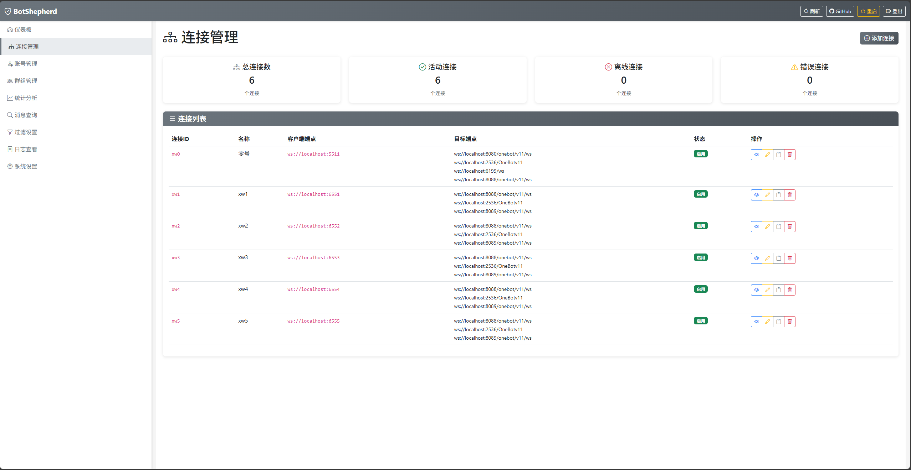
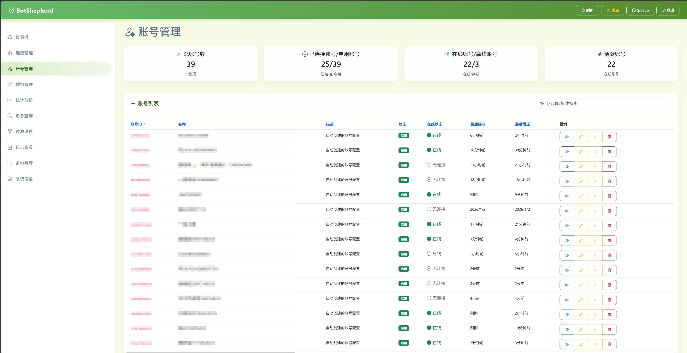
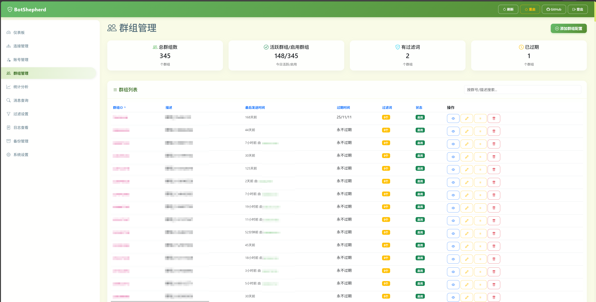
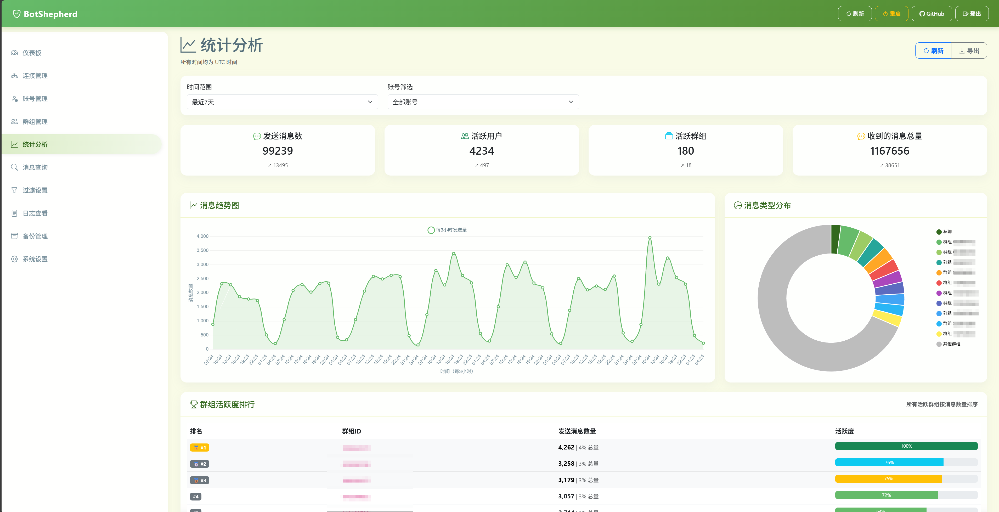

# 🐑 BotShepherd

话说，到底是谁在使用本项目？

**BotShepherd** 是一个基于OneBot v11协议WebSocket代理和管理系统，统一管理和协调多个Bot实例，实现一对多的连接管理、消息统计、跨框架黑名单、全框架分群组功能开关和别名防冲突。

**人话：一个账号只需要一个ws连接接入本系统，就可以自由的连接到下游框架。本系统可以方便的统计单个账号消息量，管理黑名单，进行指令转化等。你不再需要为每个账号创建一个Nonebot或配置 账号数量x框架数量 个ws连接**

#### 核心Feature

- 每账号消息量，跨框架黑名单，每Bot、每群、全局可以将原有指令别名，支持不更改后端就能按Bot区分不同业务（使用不同别名），支持群管理员通过过滤词的方式自助禁用指令。
- 触发指令：自己上号或主人在群里，通过指令帮助其他用户执行任何指令（bs触发 123456 some_command），避免红温，现已支持at。
- 支持对接其他系统，可自动化更新群组到期时间等 [API文档](./README_API.md)


## 📝 更新记录

### 2026-01-10 v1.0.1 完善了最初设想的所有功能

- 连接配置的更改不再需要重启
- 优化显示，完整易用的webui
- 新压力测试：每日收20W消息、发1.8W消息，占用R9 9950x的单核约2%，内存150M

<details>
<summary>点此展开历史版本</summary>

2026-01-09 v0.5.4 排除包发送行为

2026-01-03 v0.5.3 改用state判断ws状态

2026-01-02 v0.5.2 莉莉娅喵

2025-12-22 v0.5.1 界面优化

2025-12-21 v0.5.0 读写安全、功能更新

- 自动更新依赖，配置支持添加代理，使用代理更新和检查版本
- 添加 bs更新、bs备份 指令，加入更新和备份的UI，建议使用指令获得备份或从UI下载
- 修复 通知事件（如入群）、戳一戳等 不受黑名单和过滤的问题，某群某Bot某功能 的禁用都可以使用群过滤功能来实现

2025-12-10 v0.4.4 修复数据库配置-1，文案、数据库记录消息类型防止空消息

2025-10-25 v0.4.3 写入配置原子操作

2025-10-25 v0.4.2 发现了，转发消息不能附带装饰消息。我的。

2025-10-15 v0.4.0 修了一个严重的bug，情况是由于nb的api请求中params可能为str导致发送成功或失败后无法将echo发回nb，为止别的框架是否有同类问题，反正处理了。

2025-09-24 v0.3.5 减少消息数提示频率，强制旁路别名
   
2025-09-24 v0.3.4 webui编辑bug，新增过滤词and/or模式

2025-09-08 v0.3.3 若干小bug，以及小维稳定运行接近两个月 

2025-08-19 v0.3.2 修复若干连接问题，修复重启，修复koishi echo为int的问题 

2025-08-04 v0.3.0 修复了前端数据统计和导出和所有已知bug

2025-08-01 v0.2.6 没有更新，庆祝一下无严重bug持续一整周。后台收发消息量达到 100w/6.5w

2025-07-29 v0.2.5 版本支持到python3.10，取消依赖py3.12的高级字符串解析

2025-07-29 v0.2.4 优化了自动初始化环境，已在windows和root环境的vps下测试

2025-07-26 v0.2.3 修复了重连问题

2025-07-25 v0.2.2 调整数据库

2025-07-25 v0.2.1 根据实际部署情况进行修复

2025-07-24 v0.1.0 完成基本功能

2025-07-15 v0.0.0 画饼

碎碎念：虽然有些地方看上去有点AI，但实际上试了几次以后就放弃用AI写了，虽然一开始AI构建了基本框架，但后面除了webui几乎没有用上AI。框架其实也还行，就是指令框架写的比较烂。改着改着实际上只剩指令框架的基础和webui是AI写的了，而且AI还造成了大部分的bug。。。

</details>

## 🌟 核心特性
<details>
<summary>点此展开</summary>

### 🔗 连接管理
- **实时监控**：WebSocket连接状态实时监控和管理
- **自动重连**：连接断开时自动重连机制

### 📨 消息处理
- **OneBot v11标准**：兼容OneBot v11协议规范
- **消息标准化**：可选的消息格式标准化（如NapCat补充Onebot消息类兼容，自身上报支持Nonebot触发）
- **别名系统**：全局指令别名替换功能

### 🛡️ 权限与过滤
- **三级权限**：superuser > 群管/群主 > 普通用户
- **智能过滤**：全局+群组双层过滤系统
- **黑白名单**：支持用户和群组黑名单管理
- **前缀保护**：防止诱导触发的前缀保护机制

### 📊 统计分析
- **实时统计**：消息数量、指令使用、关键词统计
- **趋势分析**：7天/24小时消息量趋势图表
- **用户感知**：当消息量逐渐增加时，自动通知用户即将达到发送量上限

### 🎛️ Web管理界面
- **现代化UI**：基于Bootstrap 5的响应式界面
- **配置管理**：所有配置项的可视化管理
- **API支持**：支持API控制配置，内置群组到期时间配置,可接入自动化付费系统。

### 💾 备份与恢复
- **自动备份**：每日凌晨3点自动备份配置文件
- **加密保护**：使用AES-256加密，密码为Web登录密码
- **灵活管理**：可配置备份保留天数，自动清理过期备份
- **即时备份**：支持通过指令或Web界面立即创建备份
- **便捷下载**：Web界面一键下载备份文件

</details>

## ✅ 已测试兼容性

|                      | Nonebot | Yunzai/TRSS | AstrBot | Koishi |
|----------------------|:-------:|:-----------:|:-------:|:------:|
| Lagrange.Onebot      |   ✔️    |     ✔️      |   ✔️   |   ✔️   |
| Napcat               |   ✔️    |     ✔️      |   ✔️   |   ✔️   |
| LuckyLilliaBot(obv11)|   ✔️    |     ✔️      |   ✔️   |   ✔️   |

## 🚀 快速开始

### 环境要求
- Python 3.10+
- Git

### 安装步骤

1. **克隆项目**
```bash
git clone https://github.com/Loping151/BotShepherd.git
cd BotShepherd
```

2. **初始化环境和配置**

建议使用虚拟环境，不需要自行pip安装，将自动生成环境：
```bash
python main.py --setup
```
仅需要运行一次。

如想要自定义环境，想必了解python的基本使用，不再赘述。

3. **启动系统**
```bash
# 如果使用虚拟环境（推荐）
# 如果是Windows
./venv/Scripts/python.exe main.py
# 如果是Linux
./venv/bin/python main.py

# 或者直接使用系统Python
python main.py
```

4. **访问Web管理界面**
```
http://localhost:5100
默认用户名/密码: admin/admin
```
端口可在初始化完成后于`config/global_config.json`中修改。

5. **配置连接**

如图所示



其中：客户端端点 是 bs监听的端口，bs代替了框架成为了server，所以bs的客户端端点填写localhost即可。如果目标框架和bs不在同一台机器上，需要填写目标框架所在机器的ip。而nc的客户端端点则填写bs所在机器的ip。如果需要token，可以使用ws连接的参数，例如`ws://127.0.0.1:1212?token=123456`。

注意多个客户端不能公用一个连接配置（客户端端点），因为需要拿这个ws连接头去连接下游框架。按照标准，self_id，如QQ号，就在连接头中，一号一头。

创建完第一个连接配置后，可以点击复制快速创建多个连接配置。

### 主要功能展示：







### 后台运行
示例：使用Tmux(Linux)
```bash
sudo apt install tmux
tmux new-session -d -s botshepherd
tmux send-keys -t botshepherd "cd path/to/BotShepherd" Enter
tmux send-keys -t botshepherd '[ ! -d ./venv ] && python main.py --setup' Enter
tmux send-keys -t botshepherd "source venv/bin/activate" Enter
tmux send-keys -t botshepherd "python main.py" Enter
```
使用Docker：Windows（TODO，感觉端口映射有点烦，最好自定义范围映射）

## 🔧 指令、配置参数说明

写在webui里了

## 🛠️ 开发指南

### 项目结构
```
BotShepherd/
├── app/                   # 核心应用代码
│   ├── onebotv11/         # OneBotv11协议解析
│   ├── config/            # 配置管理
│   ├── database/          # 数据库操作
│   ├── server/            # WebSocket代理
│   ├── web_api/           # Web API接口
│   ├── commands/          # 指令系统
│   ├── plugins/           # 插件系统
│   └── utils/             # 工具类
├── config/                # 配置文件目录，备份此处即可
├── data/                  # 数据库文件目录，用于储存聊天记录
├── logs/                  # 日志文件目录
├── templates/             # HTML模板
├── static/                # 结果变成assets了
└── main.py                # 主程序入口，包含环境初始化
```

### 添加自定义指令

仅支持单次回复，支持图文。具体示例见 `app/plugins`。

```python
class MyCommand(Command):
    def __init__(self):
        super().__init__(
            name="我的指令",
            description="指令描述",
            usage="bs我的指令 [参数]"
        )

    async def execute(self, event, args, context):
        return "指令执行结果"
```

## 🤝 贡献指南

欢迎提交Issue！

## 🙏 致谢

- [OneBot](https://onebot.dev/) - 聊天机器人应用接口标准
- [NapCat](https://github.com/NapNeko/NapCatQQ) - Napcat
- [Lagrange.Onebot](https://github.com/LagrangeDev/Lagrange.Core) - Lagrange.Onebot
- [TRSS-Yunzai](https://github.com/TimeRainStarSky/Yunzai) - TRSS-Yunzai
- [Nonebot](https://github.com/nonebot/nonebot2) - Nonebot框架
- [AstrBot](https://github.com/AstrBotDevs/AstrBot) - AstrBot框架
- [Bootstrap](https://getbootstrap.com/) - UI框架，这个是AI自己加的，前端不会写喵
---

**BotShepherd** - 让Bot管理变得简单而强大 🐑✨ By Loping151 and 小维

