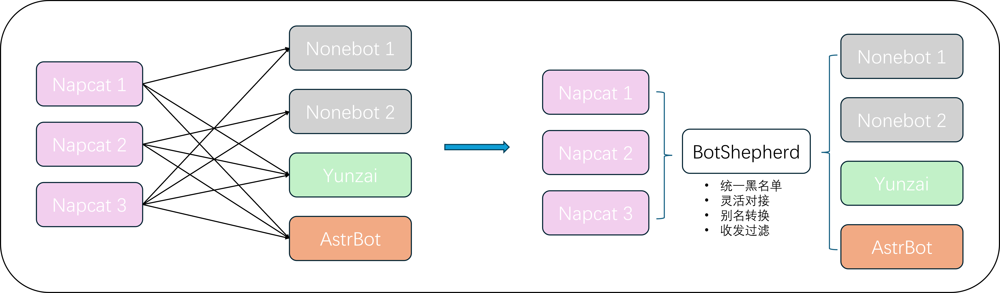

# 🐑 BotShepherd

**BotShepherd** 是一个基于OneBot v11协议WebSocket代理和管理系统。就像牧羊人管理羊群一样，BotShepherd帮助您统一管理和协调多个Bot实例，实现一对多的连接管理、消息过滤、统计分析和权限控制。

**人话：一个账号只需要一个ws连接接入本系统，就可以自由的连接到下游框架。本系统可以方便的统计单个账号消息量，管理黑名单，进行指令转化等。你不再需要为每个账号创建一个Nonebot或配置 账号数量x框架数量 个ws连接**


Powered by PPT. TODO

## 📝 更新记录

### 2025-07-24 v0.1.0 完成基本功能

<details>
<summary>点此展开</summary>
2025-07-15 v0.0.0 画饼

碎碎念：虽然有些地方看上去有点ai，但实际上试了几次以后就放弃用AI写了，虽然一开始AI构建了基本框架，但后面除了webui几乎没有用上AI。框架其实也还行，就是指令框架写的比较烂。
</details>

## 🌟 核心特性
<details>
<summary>点此展开</summary>

### 🔗 连接管理
- **实时监控**：WebSocket连接状态实时监控和管理
- **自动重连**：连接断开时自动重连机制

### 📨 消息处理
- **OneBot v11标准**：兼容OneBot v11协议规范
- **消息标准化**：可选的消息格式标准化（如NapCat补充Onebot消息类兼容，自身上报支持Nonebot触发）
- **别名系统**：全局指令别名替换功能

### 🛡️ 权限与过滤
- **三级权限**：superuser > 群管/群主 > 普通用户
- **智能过滤**：全局+群组双层过滤系统
- **黑白名单**：支持用户和群组黑名单管理
- **前缀保护**：防止诱导触发的前缀保护机制

### 📊 统计分析
- **实时统计**：消息数量、指令使用、关键词统计
- **趋势分析**：7天/24小时消息量趋势图表
- **用户感知**：当消息量逐渐增加时，自动通知用户即将达到发送量上限

### 🎛️ Web管理界面
- **现代化UI**：基于Bootstrap 5的响应式界面
- **配置管理**：所有配置项的可视化管理
- **API支持**：支持API控制配置，内置群组到期时间配置，可接入自动化付费系统。

</details>

## ✅ 已测试兼容性

|                | Nonebot | Yunzai/TRSS | AstrBot | Koishi |
|----------------|:-------:|:-----------:|:-------:|:------:|
| Lagrange.Onebot|   ✔️    |     ✔️      |   ✔️    |   ❌   |
| Napcat         |   ✔️    |     ✔️      |   ✔️    |   ❌   |

## 🚀 快速开始

### 环境要求
- Python 3.8+
- Git

### 安装步骤

1. **克隆项目**
```bash
git clone https://github.com/Loping151/BotShepherd.git
cd BotShepherd
```

2. **初始化环境和配置**
```bash
python main.py --setup
```
仅需要运行一次

3. **启动系统**
```bash
# 如果使用了虚拟环境（推荐）
./venv/bin/python main.py

# 或者直接使用系统Python
python main.py
```

4. **访问Web管理界面**
```
http://localhost:5100
默认用户名/密码: admin/admin
```
端口可在初始化完成后于`config/global_config.json`中修改。

### 后台运行
示例：使用Tmux(Linux)
```bash
sudo apt install tmux
tmux new-session -d -s botshepherd
tmux send-keys -t botshepherd "cd path/to/BotShepherd" Enter
tmux send-keys -t botshepherd '[ ! -d ./venv ] && python main.py --setup' Enter
tmux send-keys -t botshepherd "source venv/bin/activate" Enter
tmux send-keys -t botshepherd "python main.py" Enter
```
使用Docker：Windows（TODO，感觉端口映射有点烦，最好自定义范围映射）

### 一键安装说明

`--setup` 参数会自动完成以下操作：
- 检查Python版本（需要3.8+）
- 创建虚拟环境（./venv）
- 安装所有依赖包
- 创建必要的目录结构
- 初始化配置文件
- 初始化数据库

## 📖 使用指南

### 指令系统

BotShepherd内置了简单的指令系统，默认前缀为 `bs`：

- `bs帮助` - 显示帮助信息
- `bs统计 -d today` - 查看今日统计
- `bs统计 -k 关键词` - 搜索关键词
- `bs黑名单 add 123456` - 添加黑名单
- `bs触发 账号 指令` - 模拟用户发送指令

### 权限系统

1. **Superuser（超级用户）**
   - 配置在 `config/global_config.json` 中
   - 拥有所有权限，消息不受过滤限制

2. **群管理员**
   - 通过OneBot消息中的 `role` 字段识别
   - 可管理群组设置和过滤词

3. **普通用户**
   - 默认权限等级
   - 受所有过滤规则限制

### 过滤系统

#### 全局过滤
- **接收过滤**：阻止包含特定词汇的消息传递给框架
- **发送过滤**：阻止包含特定词汇的消息发送给客户端
- **前缀保护**：为特定前缀添加警告标识

#### 群组过滤
- **双层控制**：superuser设置 + 群管设置
- **优先级**：先执行superuser过滤，再执行群管过滤
- **灵活配置**：每个群组独立的过滤词列表

## 🔧 具体配置参数说明

写在webui里了

## 🛠️ 开发指南

### 项目结构
```
BotShepherd/
├── app/                    # 核心应用代码
│   ├── onebotv11/         # OneBot协议解析
│   ├── config/            # 配置管理
│   ├── database/          # 数据库操作
│   ├── server/            # WebSocket代理
│   ├── web_api/           # Web API接口
│   ├── commands/          # 指令系统
│   └── utils/             # 工具类
├── config/                # 配置文件目录
├── data/                  # 数据库文件目录
├── logs/                  # 日志文件目录
├── templates/             # HTML模板
├── static/                # 静态资源
└── main.py               # 主程序入口
```

### 添加自定义指令

仅支持单次回复，支持图文。具体示例见 `app/plugins`。

```python
class MyCommand(Command):
    def __init__(self):
        super().__init__(
            name="我的指令",
            description="指令描述",
            usage="bs我的指令 [参数]"
        )

    async def execute(self, event, args, context):
        return "指令执行结果"
```

## 🤝 贡献指南

欢迎提交Issue和Pull Request！

## 🙏 致谢

- [OneBot](https://onebot.dev/) - 聊天机器人应用接口标准
- [NapCat](https://github.com/NapNeko/NapCatQQ) - Napcat
- [Yunzai-Bot](https://github.com/yoimiya-kokomi/Yunzai-Bot) - Yunzai框架
- TODO
---

**BotShepherd** - 让Bot管理变得简单而强大 🐑✨